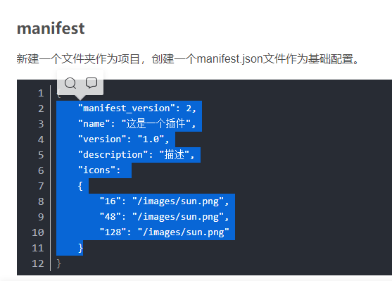
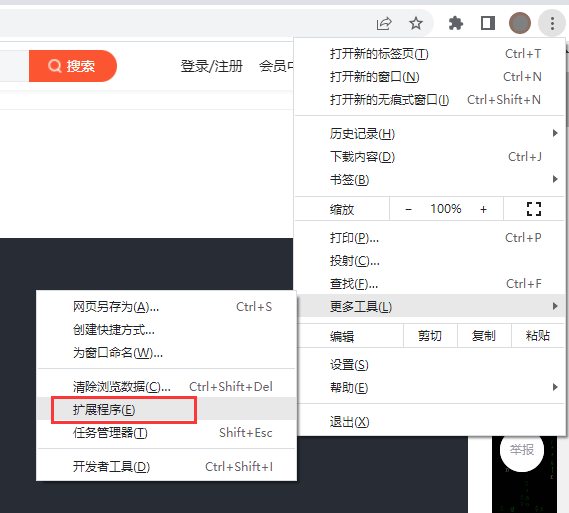
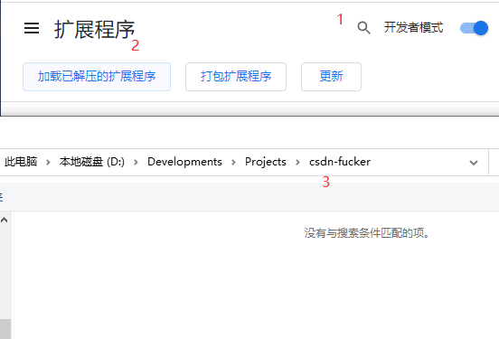
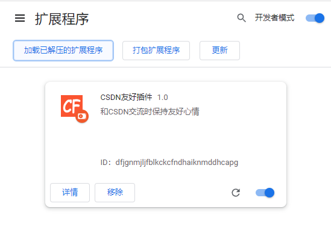

CSDN FUCKER
===========

CSDN友好插件, 可以让您没有注册CSDN网站会员时时，变得新平气和一些。

如果您觉得此软件对您有帮助，可以star进行支持。同时欢迎您issue，一起让软件变得更好。

仓库地址 https://github.com/niuhuan/csdn-fucker

## 功能与计划

- [x] 不登录的时候复制粘贴
- [x] 复制粘贴时去除尾部追加
- [ ] 自动展开隐藏的部分

## 效果与使用

### 复制粘贴效果

### 加载插件步骤

#### 克隆本仓库

复制本git仓库的http链接, 使用git克隆

#### 打开拓展程序设置

Chrome右上角的菜单 >> 更多工具 >> 拓展程序

#### 加载插件

1. 开启开发者选项
2. 加载已经解压的拓展程序
3. 选择git仓库本地副本

#### 检查插件是否正常

## 软件副本分发规则

- 您可以随意克隆和使用
- 您可以随意修改本插件
- 您修改后的插件可打包发给其他人

- 在其他页面或仓库使用本仓库的代码时, 或者分发时, 必须注明来源以及保留此说明文件
- 禁止打包CRX以及发布到任何商店

